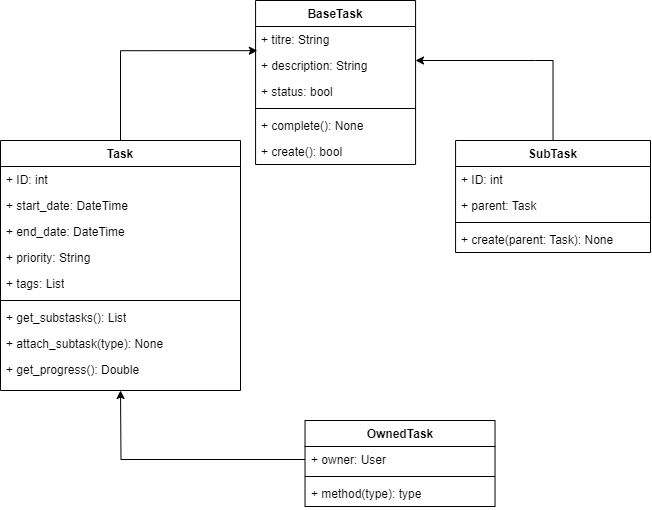

# Introduction à la Programmation Orientée Objet

## A propos

Ce dépôt contient du matériel de soutien pour le cours **Introduction à la Programmation Orientée Objet**

## Contenu

Ce dépôt est organisé comme suit :

- Vous pouvez trouver les reources PDF du cours ci-dessous:
- [Support du Cours 1](./Support%20Intro%20POO(Jour%201).pdf) et [2](./Support%20Intro%20POO(Jour%202).pdf)
- [Les TPs](./exerices/)

## Exemple projets

### Héritage & Principe d'Indirection

## Formateur

Nehemie Balukidi, [@olfredos6](https://github.com/Olfredos6)
